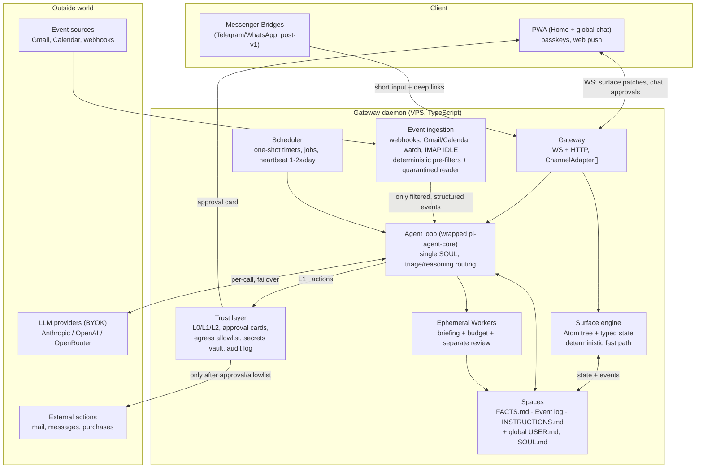
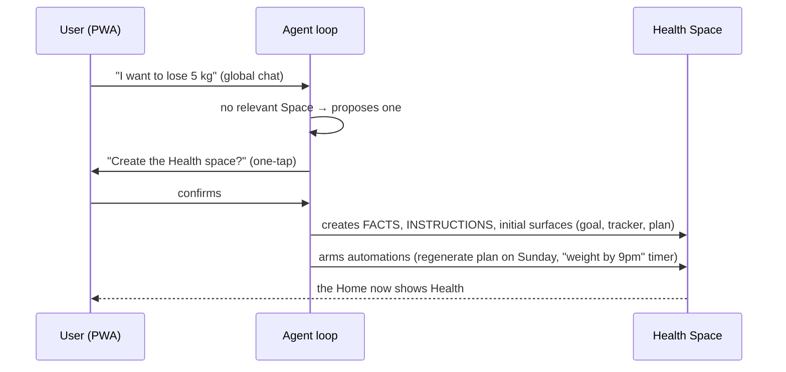

# Architecture

> The "revised picture": the original firstmate/secondmates/crewmates architecture, rethought for a home-first personal agent. Decisions are motivated in the [ADRs](docs/adr/); evidence is in the [research](docs/references/).

## 1. The thesis and the guiding principle

**Product thesis**: a personal agent with a real home (persistent Surfaces per life area) beats a personal agent inside a chat. Verified as a market gap: OpenClaw/Hermes are chat-first even with the Canvas; Skye (the closest competitor) has not launched, is iPhone-only, and is locked into WidgetKit ([ref. 02](docs/references/02-competitor-home-first.md)).

**Architectural principle**: _hierarchy lives in the data, not in agents_. The original formula (firstmate → division heads → teams) is reallocated as follows:

| Original idea                  | Where it ends up                                                         | Why                                                                                                          |
| ------------------------------ | ------------------------------------------------------------------------ | ------------------------------------------------------------------------------------------------------------ |
| Firstmate (director)           | The single agent loop                                                    | Every handoff between agents loses information (DPI, [ref. 03](docs/references/03-single-vs-multi-agent.md)) |
| Secondmates (stable divisions) | **Spaces**: namespaced memory + Surfaces                                 | The isolation that was needed was _memory_ isolation, not agent isolation                                    |
| Ephemeral crewmates            | Background **Workers**, "investigate-and-report"                         | The one case where multi-agent wins (parallel research, ~15x tokens)                                         |
| Adversarial reviewer           | Review **only on high-risk asynchronous outputs**, in a separate context | Self-review makes results worse; cross-context review gives +11pp                                            |
| Model routing                  | `ModelRef` with `triage`/`reasoning` tiers, per-call                     | RouteLLM: ~95% quality at −85% cost                                                                          |

## 2. The system at a glance

## 3. The components

### 3.1 Gateway daemon

A single self-hosted process (v1 profile: VPS with a public IP). Exposes HTTPS with automatic ACME; authentication via **passkeys/WebAuthn** and device pairing via QR. Talks to clients through the `ChannelAdapter` interface: in v1 the only adapter is the PWA (WebSocket + web push); messenger Bridges are additive post-v1 modules ([ADR-0008](docs/adr/0008-vps-passkey-byok.md)).

### 3.2 Agent loop

A single agent (one SOUL). Runtime: `@earendil-works/pi-agent-core`, **never imported directly** — wrapped behind `AgentRunner`, normalized events, `ModelRef`, `ToolDef`, `SessionStore` ([ADR-0004](docs/adr/0004-typescript-pi-agent-core.md)). Model routing is per-call: the `triage` tier (cheap) for classification, mechanical updates, event pre-triage; the `reasoning` tier (strong) for reasoning. Cross-provider failover in the router.

The agent's main tools: surfaces (`create_surface`, `patch_state`, `patch_tree`), memory (`write_fact` with the AUDN Curator, `search_log`), scheduler (`arm_timer`, `create_job`), workers (`spawn_worker`), external actions (which go through the trust layer).

### 3.3 Spaces

`spaces/<name>/`: `FACTS.md` (bi-temporal facts, `## Superseded` section), append-only Event log (recent portion in context, long tail via hybrid search with a time-aware index), `INSTRUCTIONS.md`, Surfaces and Automations. Global: `USER.md`, `SOUL.md`. Files are the truth; indexes are rebuildable ([ADR-0006](docs/adr/0006-file-based-memory.md)). Lifecycle: the Agent _proposes_ creation (one-tap confirmation), granularity = life area (goals are Surfaces, not Spaces), archival never deletion. A Space's memory is visible and editable as a Surface ("what I know about you here").

### 3.4 Surface engine

A Surface = **a declarative tree of Atoms + typed state + bindings**. Closed catalog (~24 ChatKit-style Atoms + `Progress`, `Stat`, `ListItem`, `Automation`), protocol based on **Google's A2UI** ([ADR-0003](docs/adr/0003-declarative-atoms.md)). Every Atom action declares its path:

- **Fast path**: the daemon mutates the state and logs the event to the Event log — zero LLM, native-app latency. _Memory contract_: the Agent always reads the events before reasoning about a Space.
- **Agent path**: the action goes to the Agent with an honest wait.

Good compositions become **Templates** saved in the Space and reused/patched (visual consistency across regenerations).

### 3.5 Proactivity (4 tiers, by increasing cost)

LLM polling every 30 minutes is beaten on cost _and accuracy_ ([ref. 05](docs/references/05-proactivity-architectures.md)):

1. **Push events** (near-zero cost, reaction in seconds): Gmail/Calendar watch, IMAP IDLE, HMAC-validated webhooks.
2. **One-shot timers**: every learned deadline/habit arms a timer that checks a condition at the deadline. They replace the periodic "is anything stale?". Visible as Automations.
3. **Non-LLM pre-filters**: rules, embedding similarity, optionally a lightweight classifier. Milliseconds.
4. **LLM cascade on the residue** (triage → reasoning) + **safety-net Heartbeat 1-2x/day** for fuzzy conditions.

Notification discipline: silent update → badge on the Space → push (the bar: "would a good human assistant interrupt?"), per-Space interruption budgets, freshness metadata on every Surface. Non-urgent notifications queue up for idle moments.

### 3.6 Workers and review

Ephemeral Workers only for tasks that are (a) parallelizable and read-heavy, (b) worth 4-15x the tokens, (c) "investigate-and-report" with no implicit decisions. Detailed briefing (goal, format, tools, boundaries), iteration cap, explicit termination, schema-validated output. Adversarial review **in a separate context**, only on high-risk outputs before delivery into the Space.

### 3.7 Trust layer

Three levels (L0 free / L1 approval-first with a relaxable allowlist / L2 never automatic) + the untrusted content rule + quarantined reader + egress allowlist + secrets vault + audit log. Details in [SECURITY.md](docs/SECURITY.md) ([ADR-0007](docs/adr/0007-trust-levels.md)).

## 4. Key flows

### "I want to lose 5 kg" (day one)

### Tapping a checkbox (fast path)

"Milk" checkbox → the daemon mutates the Surface state and appends `2026-07-03: checked off milk` to the Event log. **No LLM call.** On the next turn ("what's missing?") the Agent reads the events and answers correctly.

### Incoming mail (external event)

Gmail webhook → deterministic pre-filter (newsletter? discard) → **quarantined reader** (cheap LLM with no tools, validated structured output) → if relevant, the structured event enters the Agent's context marked untrusted → the Agent updates Surfaces (L0, free); if it wants to reply to the mail (L1), it prepares the **approval card** — always, because the turn contains untrusted content.

## 5. Stack

- **TypeScript everywhere**, pnpm monorepo: `daemon`, `pwa`, `protocol` (shared atom/surface schema), `catalog` (renderer).
- Agent runtime: `@earendil-works/pi-agent-core` (MIT, production-validated by OpenClaw), wrapped for reversibility; plan B: Vercel AI SDK v6 ([ref. 07](docs/references/07-runtime-typescript.md)).
- Persistence: filesystem (memory) + SQLite (sessions, surface state, search index, audit log).
- PWA: installable, web push, catalog renderer with its own design system — visual consistency is the differentiator, the Agent brings the data.

## 6. Onboarding and migration

A `curl | bash` installer that emits a **JSON stage protocol** rendered by the wizard _in the PWA_ (Hermes pattern). **Importers from OpenClaw and Hermes** as an acquisition weapon, with the discipline learned from studying their repos ([ref. 04](docs/references/04-onboarding-migration.md)): preview-first (always dry-run), atomic restorable backup, secrets never migrated implicitly, never partial states, every dead end prints the next command. Code structure OpenClaw-style (one file per step, test alongside), polish Hermes-style.

## 7. What we do NOT build (anti-requirements)

- Persistent agent hierarchies (division heads, teams) — [ref. 03](docs/references/03-single-vs-multi-agent.md)
- Free-form HTML/JSX generated by the agent (until post-v1, and sandboxed in any case)
- Knowledge graphs, extraction-as-truth, destructive forgetting, trained retrieval — [ref. 06](docs/references/06-memory-research.md)
- Adversarial review on the synchronous path
- Rich UI inside messengers (Bridges reply short and link to the Home)
- Multi-tenancy, marketplace, voice (post-v1)
