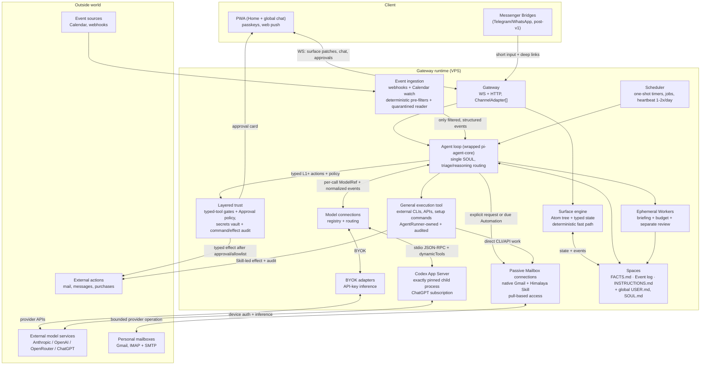
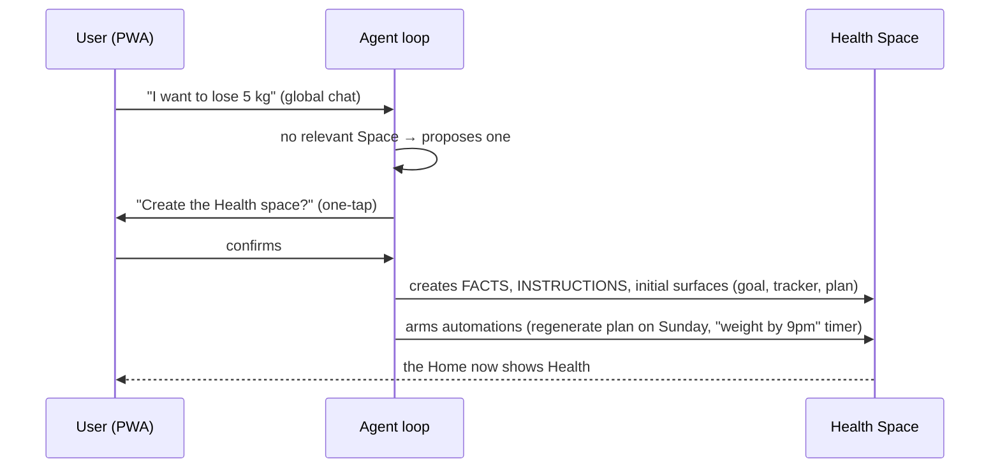

# Architecture

> Veduta is a home-first personal agent whose hierarchy lives in data, not in persistent agent
> roles. Decisions are motivated in the [ADRs](docs/adr/); evidence is in the
> [research](docs/references/).

## 1. The thesis and the guiding principle

**Product thesis**: a personal agent with a real home (persistent Surfaces per life area) beats a personal agent inside a chat. Verified as a market gap: OpenClaw/Hermes are chat-first even with the Canvas; Skye (the closest competitor) has not launched, is iPhone-only, and is locked into WidgetKit ([ref. 02](docs/references/02-competitor-home-first.md)).

**Architectural principle**: _hierarchy lives in the data, not in agents_. One Agent selectively
works across namespaced **Spaces**. Ephemeral **Workers** are limited to parallel, read-heavy
investigate-and-report work, with separate review only for high-risk asynchronous output. Model
routing remains a per-call choice through `ModelRef`. The rejected persistent-agent alternatives
and their evidence are recorded in [ADR-0002](docs/adr/0002-single-agent-spaces.md) and
[ref. 03](docs/references/03-single-vs-multi-agent.md).

## 2. The system at a glance

```mermaid
flowchart TB
    subgraph Client["Client"]
        PWA["PWA (Home + global chat)\npasskeys, web push"]
        TG["Messenger Bridges\n(Telegram/WhatsApp, post-v1)"]
    end

    subgraph Daemon["Gateway runtime (VPS)"]
        GW["Gateway\nWS + HTTP, ChannelAdapter[]"]
        SE["Surface engine\nAtom tree + typed state\ndeterministic fast path"]
        AL["Agent loop (wrapped pi-agent-core)\nsingle SOUL, triage/reasoning routing"]
        MC["Model connections\nregistry + routing"]
        BYOK["BYOK adapters\nAPI-key inference"]
        CODEX["Codex App Server\nexactly pinned child process\nChatGPT subscription"]
        SCH["Scheduler\none-shot timers, jobs, heartbeat 1-2x/day"]
        ING["Event ingestion\nwebhooks + Calendar watch\ndeterministic pre-filters + quarantined reader"]
        EXEC["General execution tool\nexternal CLIs, APIs, setup commands\nAgentRunner-owned + audited"]
        MBX["Passive Mailbox connections\nnative Gmail + Himalaya Skill\npull-based access"]
        MEM["Spaces\nFACTS.md · Event log · INSTRUCTIONS.md\n+ global USER.md, SOUL.md"]
        SEC["Layered trust\ntyped-tool gates + Approval policy,\nsecrets vault + command/effect audit"]
        WK["Ephemeral Workers\nbriefing + budget + separate review"]
    end

    subgraph Esterno["Outside world"]
        LLM["External model services\nAnthropic / OpenAI / OpenRouter / ChatGPT"]
        SRC["Event sources\nCalendar, webhooks"]
        MAIL["Personal mailboxes\nGmail, IMAP + SMTP"]
        ACT["External actions\nmail, messages, purchases"]
    end

    PWA <-->|"WS: surface patches, chat, approvals"| GW
    TG -->|"short input + deep links"| GW
    GW --> SE
    GW --> AL
    SE <-->|"state + events"| MEM
    AL <--> MEM
    AL <-->|"per-call ModelRef + normalized events"| MC
    MC <-->|"BYOK"| BYOK
    MC <-->|"stdio JSON-RPC + dynamicTools"| CODEX
    BYOK <-->|"provider APIs"| LLM
    CODEX <-->|"device auth + inference"| LLM
    AL --> WK
    AL --> EXEC
    WK --> MEM
    SRC --> ING
    ING -->|"only filtered, structured events"| AL
    AL -->|"explicit request or due Automation"| MBX
    EXEC -->|"direct CLI/API work"| MBX
    MBX <-->|"bounded provider operation"| MAIL
    SCH --> AL
    AL -->|"typed L1+ actions + policy"| SEC
    SEC -->|"approval card"| PWA
    SEC -->|"typed effect after approval/allowlist"| ACT
    EXEC -->|"Skill-led effect + audit"| ACT
```

## 3. The components

### 3.1 Gateway daemon

A single self-hosted Gateway deployment (v1 profile: VPS with a public IP), centred on a TypeScript
daemon. It exposes HTTPS with automatic ACME; authentication uses **passkeys/WebAuthn** and device
pairing via QR. It talks to clients through the `ChannelAdapter` interface: in v1 the only adapter
is the PWA (WebSocket + web push); messenger Bridges are additive post-v1 modules
([ADR-0008](docs/adr/0008-vps-passkey-byok.md)). A ChatGPT subscription Model connection also
starts the exactly pinned Codex App Server child shown above; BYOK connections remain inside the
daemon process.

### 3.2 Agent loop

A single agent (one SOUL). Runtime: `@earendil-works/pi-agent-core`, **never imported directly** — wrapped behind `AgentRunner`, normalized events, `ModelRef`, `ToolDef`, `SessionStore` ([ADR-0004](docs/adr/0004-typescript-pi-agent-core.md)). Model routing is per-call: the `triage` tier (cheap) for classification, mechanical updates, event pre-triage; the `reasoning` tier (strong) for reasoning. Cross-provider failover in the router.

Each `ModelRef` resolves through the Gateway-owned Model connection registry. BYOK adapters call
Anthropic, OpenAI, or OpenRouter with user-supplied API keys. The ChatGPT subscription adapter
instead controls an exactly pinned `codex app-server` child over stdio JSON-RPC for managed device
authorization, model discovery, and inference. Claude subscription stays visibly unavailable until
Anthropic publishes or approves a third-party contract; Anthropic BYOK remains available
([ADR-0014](docs/adr/0014-subscription-inference-boundary.md)).

Every adapter supplies inference only. On the Codex path, the adapter maps allowed `ToolDef`
definitions, calls, and results through `dynamicTools`; `AgentRunner` remains the only owner of
validation and handler execution, trust decisions, Event log writes, and Surface changes.
Codex-native command execution, patches, web search, MCP, and approvals remain disabled
([ADR-0016](docs/adr/0016-primary-agent-connections-author-surfaces.md),
[security contract](docs/SECURITY.md)). The
[real-account smoke](docs/references/11-model-connections-manual-smoke.md) verifies authorization,
inference, and Surface creation and patching without BYOK; the
[protocol capture](docs/references/13-codex-dynamic-tools-0.146.1.md) records the pinned boundary.
Automation, Worker, and final Connection parity remain tracked by
[issue 070](issues/070-codex-tool-parity.md) and its open
[077](issues/077-chatgpt-subscription-automations.md),
[078](issues/078-chatgpt-subscription-workers.md), and
[079](issues/079-primary-connection-parity.md) slices.

The agent's main tools: focused-Space Surface discovery and authoring (`list_surfaces`,
`read_surface`, Space-bound `create_surface`, `patch_state`, `patch_tree`), memory (`write_fact`
with the AUDN Curator, `search_log`), scheduler (`arm_timer`, `create_job`), workers
(`spawn_worker`), typed external actions, and a Veduta-owned general execution tool. The latter may
run external CLIs, APIs, and setup commands through `AgentRunner`; it is distinct from—and does not
enable—provider-native command execution. Surface readers are L0 and report stored content origins,
so reading untrusted Surface content grows the live turn taint before any later action.

Feature-specific, first-party **Skills** give the Agent reusable procedures without changing which
tools the current turn already has. Interactive turns expose eligible metadata and let the Agent
load one or more relevant Skills autonomously; confirmed Automations preload their compatible Skill
set deterministically. A Skill may teach typed tools, direct CLI/API use, and supported dependency
setup. v1 packages contain concise Markdown plus focused one-hop references; first-party executable
support files enter in v1.1. The general execution tool is intentionally broad, so Approval and
Automation scope are official Agent behavior and audit contracts rather than a universal semantic
sandbox for arbitrary commands ([ADR-0026](docs/adr/0026-skills-may-drive-general-tool-execution.md)).

### 3.3 Spaces

`spaces/<name>/`: `FACTS.md` (bi-temporal facts in three states — active, `## Dormant`, `## Superseded`), append-only Event log (recent portion in context, long tail via hybrid search with a time-aware index), `INSTRUCTIONS.md`, Surfaces and Automations. Global: `USER.md`, `SOUL.md`. Files are the truth; the SQLite FTS5 index is disposable and rebuildable with one command, and every hit dereferences the original record ([ADR-0006](docs/adr/0006-file-based-memory.md), [ADR-0011](docs/adr/0011-disposable-hybrid-index.md)). The nightly **Reflection** is the offline compaction pass: it distills the day's log, consolidates FACTS through the Curator, and demotes still-valid facts to dormant to keep the injected set bounded — a visible Automation, never a silent cleanup. Lifecycle: the Agent _proposes_ creation (one-tap confirmation), granularity = life area (goals are Surfaces, not Spaces), archival never deletion. A Space's memory is visible and editable as a Surface ("what I know about you here").

### 3.4 Surface engine

A Surface = **a declarative tree of Atoms + typed state + bindings**. Closed catalog (~24 ChatKit-style Atoms + `Progress`, `Stat`, `ListItem`, `Automation`), protocol based on **Google's A2UI** ([ADR-0003](docs/adr/0003-declarative-atoms.md)). Every Atom action declares its path:

- **Fast path**: the daemon mutates the state and logs the event to the Event log — zero LLM, native-app latency. _Memory contract_: the Agent always reads the events before reasoning about a Space.
- **Agent path**: the action goes to the Agent with an honest wait.

The engine also owns an explicit Space-scoped authorable-reader boundary. Focused turns request a
stable compact inventory on demand, then read one complete `SurfaceSchema`-validated Surface with
its stored versions before patching it. Archived, projected FACTS, daemon-owned, and other-Space
Surfaces are outside that boundary and share one non-disclosing refusal. The focused
`create_surface` wrapper injects the current Space and delegates to the existing Template gate;
the raw engine creation operation remains explicitly Space-scoped for daemon and future
multi-Space callers. Surface inventories are not injected into every assembled context.

Focused-Space Surface authoring includes analytical answers with a useful structured, persistent
form, even when the question does not mutate source data. The Agent inspects the complete affected
set, enriches the Surface that owns the concern, or creates a distinct Surface through the normal
Template gate when none fits. Follow-ups replace or remove derived regions instead of accumulating
snapshots; source records remain durable. Ordinary conversation without visual payoff remains
chat-only, and chat reports the committed mutation, Tree proposal, or failure honestly.

Progressive composition remains inside this same validated contract: the Agent creates the full
layout with typed `Pending` leaf Atoms, then replaces each slot in place with an independent,
versioned `patch_tree` operation as its content becomes ready. Preserving the Atom id limits the
entrance transition to the filled region, while memoized, unchanged siblings do not render again.
The daemon stamps the start of every Pending window; the catalog renders token-driven text, list,
image, stat, and chart skeletons and degrades an unresolved slot to a visible fallback when that
persisted window expires, including after a reload. No streaming format or second parser is
involved ([ADR-0003](docs/adr/0003-declarative-atoms.md),
[issue 029](issues/029-progressive-surface-composition.md)).

Relative calendar views also stay inside the Surface contract. An optional `validity` descriptor
names a separate durable source array, its effective-occurrence field, every projected state key,
the global user timezone, and the Gateway-derived start/expiry instants. The Agent preserves source
history and patches every projection together; the Gateway rejects partial projection updates and
normalizes occurrence instants. At the expiry boundary, readers report the view as expired and the
PWA changes to a visible expired state on its own timer, without inventing a domain event or waiting
for a Heartbeat. Undated legacy source records remain durable but are excluded with a visible caveat
([ADR-0003](docs/adr/0003-declarative-atoms.md),
[issue 134](issues/134-relative-time-surface-views.md)).

Good compositions become **Templates** saved in the Space and reused/patched (visual consistency across regenerations): a tree that has stopped changing — or that the user **pins** — is captured without its data, matched deterministically on intent and Atom signature, and reused instead of regenerated; regenerating over a match requires a justification. A pinned Surface keeps receiving state patches, while a tree change becomes a **Tree proposal** with a preview the user accepts or rejects ([ADR-0012](docs/adr/0012-emergent-templates.md)).

### 3.5 Proactivity (4 tiers, by increasing cost)

LLM polling every 30 minutes is beaten on cost _and accuracy_ ([ref. 05](docs/references/05-proactivity-architectures.md)):

1. **Push events** (near-zero cost, reaction in seconds): Calendar watch and HMAC-validated webhooks whose continuous delivery was explicitly configured.
2. **One-shot timers**: every learned deadline/habit arms a timer that checks a condition at the deadline. They replace the periodic "is anything stale?". Visible as Automations.
3. **Non-LLM pre-filters**: rules, embedding similarity, optionally a lightweight classifier. Milliseconds.
4. **LLM cascade on the residue** (triage → reasoning) + **safety-net Heartbeat 1-2x/day** for fuzzy conditions.

Notification discipline: silent update → badge on the Space → push (the bar: "would a good human assistant interrupt?"), per-Space interruption budgets, freshness metadata on every Surface. Non-urgent notifications queue up for idle moments. Meaningful recurring dashboard outcomes instead update their linked Surface and create a durable In-app notification inside the owning Space; they never manufacture global chat, badge, or browser-push traffic ([ADR-0021](docs/adr/0021-space-owned-automation-outcomes.md)).

A personal Mailbox is deliberately outside push ingestion. Its Gateway-wide connection stays
passive until a focused user request or a due occurrence of a confirmed Automation resolves an
explicit Mailbox scope. A Gmail Skill uses native Gmail operations; a Himalaya Skill teaches the
Agent to operate generic IMAP/SMTP accounts directly through the general execution tool. Search,
summary, and Automation preserve unread state; an Explicit mail read marks only the selected
message read. Results converge on Space-owned Mailbox Surfaces rather than an inbox clone or a
provider-neutral command layer ([ADR-0024](docs/adr/0024-pull-based-personal-mailbox.md),
[ADR-0026](docs/adr/0026-skills-may-drive-general-tool-execution.md)).

### 3.6 Workers and review

Ephemeral Workers only for tasks that are (a) parallelizable and read-heavy, (b) worth 4-15x the tokens, (c) "investigate-and-report" with no implicit decisions. Detailed briefing (goal, format, tools, boundaries), iteration cap, explicit termination, schema-validated output. Adversarial review **in a separate context**, only on high-risk outputs before delivery into the Space.

### 3.7 Trust layer

Three levels (L0 free / L1 approval-first with a relaxable allowlist / L2 never automatic),
origin tracking, the quarantined reader, secrets handling, and audit remain the policy for official
Agent behavior. Typed product tools enforce their declared gates in code. The general execution
tool is broader: its commands and outcomes are traced and official Skills follow the same policy,
but Veduta does not claim complete semantic mediation of arbitrary shell behavior. Details in
[SECURITY.md](docs/SECURITY.md) ([ADR-0007](docs/adr/0007-trust-levels.md),
[ADR-0026](docs/adr/0026-skills-may-drive-general-tool-execution.md)).

## 4. Key flows

### "I want to lose 5 kg" (day one)

```mermaid
sequenceDiagram
    participant U as User (PWA)
    participant A as Agent loop
    participant S as Health Space
    U->>A: "I want to lose 5 kg" (global chat)
    A->>A: no relevant Space → proposes one
    A->>U: "Create the Health space?" (one-tap)
    U->>A: confirms
    A->>S: creates FACTS, INSTRUCTIONS, initial surfaces (goal, tracker, plan)
    A->>S: arms automations (regenerate plan on Sunday, "weight by 9pm" timer)
    S-->>U: the Home now shows Health
```

### Tapping a checkbox (fast path)

"Milk" checkbox → the daemon mutates the Surface state and appends `2026-07-03: checked off milk` to the Event log. **No LLM call.** On the next turn ("what's missing?") the Agent reads the events and answers correctly.

### Explicit mailbox work

“Summarize today's unread newsletters” in a focused Space → the Agent resolves the account, query,
time window, read-state filter, and result bound → it autonomously loads the first-party Mailbox
Skill plus the relevant connector Skill → Gmail uses native operations or Himalaya runs directly
through the general execution tool → Untrusted provider output is bounded and summarized → the
Agent responds with concise text and a query-labelled Mailbox Surface. Opening one result starts a
new interaction, retrieves the body transiently, and marks only that message read. A reply becomes
an editable **Approval card**; after approval, the Agent sends it in the provider thread and
reports the verified outcome.

### Monitoring a public website

Confirmed Website monitor → bounded conditional read from approved hosts → quarantined extraction
of relevant same-site candidates → isolated full-text processing when needed → schema-valid update
of one linked Surface → coalesced In-app notification in the same Space. Raw pages never enter the
primary Agent's context, and a new host requires a new Pending decision
([ADR-0022](docs/adr/0022-goal-directed-website-monitors.md)).

## 5. Stack

- **TypeScript everywhere**, pnpm monorepo: `daemon`, `pwa`, `protocol` (shared atom/surface schema), `catalog` (renderer).
- Agent runtime: `@earendil-works/pi-agent-core` (MIT, production-validated by OpenClaw), wrapped for reversibility; plan B: Vercel AI SDK v6 ([ref. 07](docs/references/07-runtime-typescript.md)).
- Persistence: filesystem (memory) + SQLite (sessions, surface state, search index, audit log).
- PWA: installable, web push, catalog renderer with its own design system — visual consistency is the differentiator, the Agent brings the data.

## 6. Onboarding and migration

A `curl | bash` installer that emits a **JSON stage protocol** rendered by the wizard _in the PWA_ (Hermes pattern). **Importers from OpenClaw and Hermes** as an acquisition weapon, with the discipline learned from studying their repos ([ref. 04](docs/references/04-onboarding-migration.md)): preview-first (always dry-run), atomic restorable backup, secrets never migrated implicitly, never partial states, every dead end prints the next command. Code structure OpenClaw-style (one file per step, test alongside), polish Hermes-style.

## 7. What we do NOT build (anti-requirements)

- Persistent agent hierarchies (division heads, teams) — [ref. 03](docs/references/03-single-vs-multi-agent.md)
- Free-form HTML/JSX generated by the agent (until post-v1, and sandboxed in any case)
- Knowledge graphs, extraction-as-truth, destructive forgetting, trained retrieval — [ref. 06](docs/references/06-memory-research.md)
- Adversarial review on the synchronous path
- Rich UI inside messengers (Bridges reply short and link to the Home)
- Multi-tenancy, marketplace, voice (post-v1)
